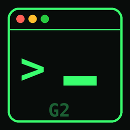
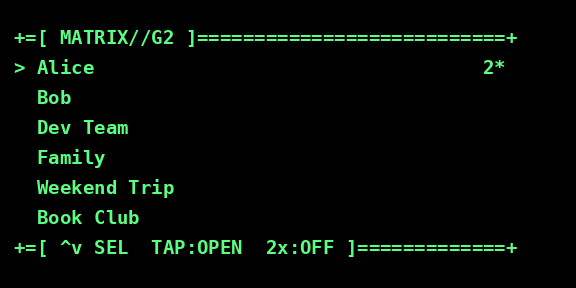
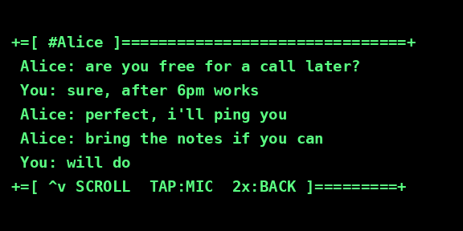
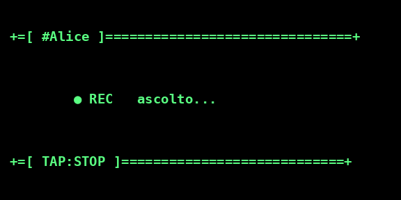
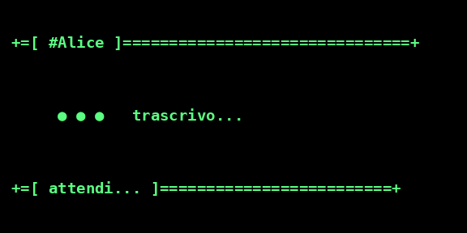
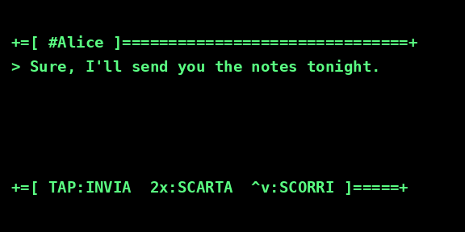

<p align="center">
  
</p>

# Matrix G2

Un client **[Matrix](https://matrix.org)** per gli occhiali smart **[Even Realities G2](https://www.evenrealities.com/)**.
Leggi le tue chat sull'HUD degli occhiali, aprine una, scorri i messaggi e
rispondi **a voce** (dettatura trascritta e inviata come messaggio Matrix). Mani
libere, niente telefono in mano.

Supporta chat **cifrate end-to-end**: il device viene verificato via cross-signing
e la cronologia cifrata si sblocca importando le chiavi dal key backup, tutto con
la tua Security Key / passphrase Matrix.

> ⚠️ Progetto community, non affiliato a Even Realities né a Matrix.org.

## Screenshots

Come appare sull'HUD (verde su micro-LED, 576×288):

| Lista chat | Chat | Dettatura | Trascrizione | Conferma |
|:---:|:---:|:---:|:---:|:---:|
|  |  |  |  |  |

## Come funziona

Gli occhiali non parlano mai direttamente con un server: passano sempre dal
telefono (app Even Hub, hub BLE obbligatorio), che a sua volta raggiunge il
**bridge** sulla tua rete (o via VPN).

```
┌────────────┐   BLE    ┌──────────────────┐  WebSocket   ┌───────────────────────┐   HTTPS   ┌──────────────┐
│ occhiali   │ ───────▶ │ telefono         │ ───────────▶ │ bridge (matrix_bridge │ ────────▶ │ homeserver   │
│ Even G2    │  on-body │ (app Even Hub)   │   (VPN/LAN)  │ .py) — Python + nio   │           │ Matrix       │
└────────────┘          └──────────────────┘              └───────────────────────┘           └──────────────┘
   HUD + mic             WebView (app/)                     STT + E2EE + sync
```

- **App occhiali** (`app/`) — WebView TypeScript/Vite. Solo I/O device: disegna
  l'HUD, cattura gesti e microfono, li manda al bridge via WebSocket. Nessuna
  logica Matrix a bordo.
- **Bridge** (`matrix_bridge.py`) — daemon Python. Tiene la sessione Matrix (un
  solo device), fa il sync, la decryption E2EE, la trascrizione vocale locale
  (whisper) e l'invio. Espone un WebSocket per l'app.

La **sessione Matrix vive solo nel bridge**: l'app non tocca mai l'homeserver, le
manda soltanto le credenziali una volta. Così c'è un unico device Matrix stabile,
niente sessioni duplicate a ogni riavvio dell'app.

## Requisiti

- Occhiali **Even Realities G2** + app **Even Hub** sul telefono.
- Un account **Matrix** (homeserver qualsiasi: Synapse, Dendrite, matrix.org…).
- Una macchina **sempre accesa** per il bridge (Python 3.10+): un mini-server, un
  Raspberry, un VPS. Fuori casa serve che il telefono e il bridge siano sulla
  stessa rete virtuale (**VPN**: WireGuard, Tailscale…) oppure il bridge esposto
  con un dominio HTTPS.
- Un reverse proxy con TLS (esempio nginx incluso) per esporre `wss://`.

## Installazione

### 1. Bridge

```bash
git clone https://github.com/<owner>/matrix-g2.git
cd matrix-g2
python3 -m venv .venv && source .venv/bin/activate
pip install -r requirements.txt          # tira dentro anche python-olm per l'E2EE
```

> `matrix-nio[e2e]` richiede **libolm** installata a livello di sistema.
> Debian/Ubuntu: `sudo apt install libolm-dev`. macOS: `brew install libolm`.

Avvia il bridge (ascolta su `0.0.0.0:8792`):

```bash
python3 matrix_bridge.py
```

Al primo avvio non ci sono credenziali: le fornisce l'app al login (passo 4).
Il bridge salva la sessione in `matrix_creds.json` e lo store E2EE in `nio_store/`
(entrambi accanto allo script, o nei path indicati da `BRIDGE_CREDS_FILE` /
`BRIDGE_STORE_PATH`). **Nessuno dei due va committato** — sono già in `.gitignore`.

Per farlo girare come servizio, adatta e installa la unit systemd:

```bash
sudo cp deploy/eveng2-matrix.service /etc/systemd/system/
sudoedit /etc/systemd/system/eveng2-matrix.service   # imposta User, path
sudo systemctl daemon-reload
sudo systemctl enable --now eveng2-matrix
journalctl -u eveng2-matrix -f
```

### 2. Reverse proxy (TLS)

L'app WebView deve raggiungere il bridge su `wss://`. Includi i blocchi di
`deploy/nginx-matrix-g2.conf` nel tuo `server { }` HTTPS: proxano
`wss://<dominio>/ws/matrix-g2` → `127.0.0.1:8792` e servono il pacchetto `.ehpk`.

Fuori da questo, va bene qualsiasi proxy che faccia upgrade WebSocket (Caddy,
Traefik…). Il bridge di per sé parla `ws://` in chiaro sulla LAN: metti sempre il
TLS davanti.

### 3. Build dell'app occhiali

```bash
cd app
npm install
cp .env.example .env          # imposta VITE_BRIDGE_URL = wss://<tuo-dominio>/ws/matrix-g2
npm run typecheck && npm run build
npx evenhub pack app.json dist -o matrix-g2.ehpk
```

Carica `matrix-g2.ehpk` come **build privata** sul portale Even Hub (o via QR
sideload: `npx evenhub qr --url http://<tuo-ip>:5173`). Vedi `app/README.md` per
i dettagli e lo sviluppo in browser senza occhiali.

### 4. Login (dal telefono)

Apri l'app Matrix G2 sugli occhiali. Sul telefono compare il form:

1. **Server / Username / Password** del tuo account Matrix → *Accedi*.
2. Nella schermata successiva inserisci la tua **Security Key** (recovery key
   Matrix, 12 gruppi da 4 caratteri) **oppure** la **passphrase** che usi per lo
   Secure Backup. Serve a verificare la sessione (cross-signing) e a sbloccare la
   storia cifrata. Puoi anche *Saltare* e aggiungerla dopo.

Se la verifica va a buon fine l'app mostra **🔐 Sessione verificata** e sugli
occhiali compare la lista delle chat. Da lì: swipe per scegliere, tap per aprire,
tap in chat per dettare la risposta. (Controlli completi in `app/README.md`.)

## Sicurezza & privacy

- **Nessun segreto nel repo.** Credenziali (`matrix_creds.json`), store E2EE
  (`nio_store/`) e `.env` sono ignorati da git. La Security Key/passphrase viene
  usata dal bridge per la verifica e l'import backup e salvata solo localmente
  nel creds file — metti permessi stretti su quel file e sulla macchina.
- **La dettatura vocale è locale**: la trascrizione usa faster-whisper sul bridge,
  l'audio non lascia la tua infrastruttura.
- Metti **sempre TLS** (`wss://`) tra telefono e bridge quando esci dalla LAN.
- Il bridge accetta connessioni WebSocket senza auth propria: proteggilo a livello
  di rete (bind su localhost dietro il proxy, o firewall/VPN). Chi raggiunge il
  WebSocket può pilotare la sessione Matrix già loggata.

## Stato & limiti noti

Funziona end-to-end: login+verifica, lista chat, lettura (con backfill della
storia via `/messages`), dettatura vocale → invio, E2EE. Da tenere presente:

- Lo **stato dell'HUD è condiviso** tra i client WebSocket connessi: due client
  insieme si "pestano" la navigazione. Uso normale = un client, nessun problema.
- La **dettatura** si avvia e si ferma **a tap** (tap in chat = start, tap di nuovo
  = stop). Dopo la trascrizione: swipe per scorrere il testo, 1 tap invia, 2 tap
  scarta. C'è solo un tetto di sicurezza sulla durata (`REC_MAX_SEC`, 120s).
- La **qualità STT** dipende dal modello whisper (`BRIDGE_WHISPER_MODEL`, default
  `medium`): su CPU `medium` è un buon compromesso; `large-v3` è più preciso ma
  più lento. Il modello viene scaricato al primo uso.
- L'**HUD** ha un look "terminale" (barre ASCII sopra/sotto, autoscroll a fondo
  chat, effetto typewriter). Le dimensioni (`W`/`H` nel bridge, `COLS`/`ROWS`
  nell'app) sono tarate per l'area visibile del G2: se il bordo si taglia sul tuo
  device, riducile in coppia.
- Alcune stanze senza nome esplicito possono restare "Empty Room" finché i membri
  non vengono risolti.

## Licenza

MIT — vedi [LICENSE](LICENSE).
